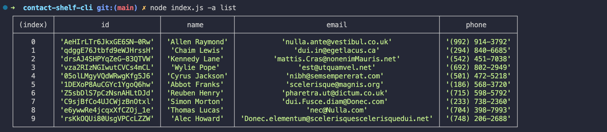
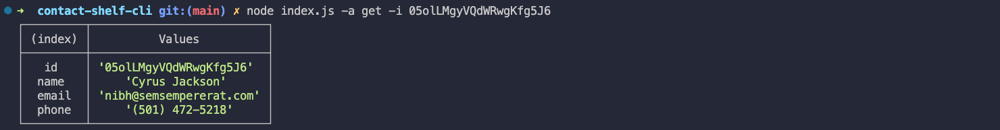
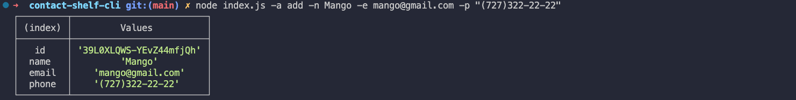
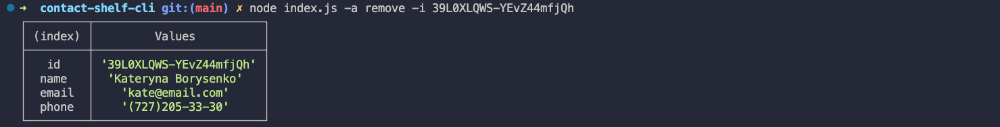
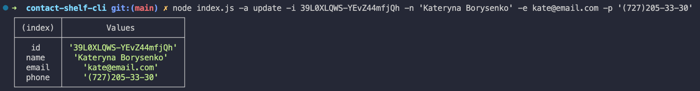

# Contact Shelf CLI

## Description

Contact Shelf CLI is a command-line application for managing contacts. It allows users to perform basic CRUD operations (Create, Read, Update, Delete) on contacts stored in a JSON file.

## Installation

To run this project, you must have [Node.js](https://nodejs.org/) installed.

1. Clone the project repository:

```
    git clone https://github.com/Kateryna-Borysenko/contact-shelf-cli.git
```

2. Navigate to the project directory:

```
    cd contact-shelf-cli
```

3.  Install the required dependencies:

```
    npm install
```

## Usage

After installation, you can use the following commands to manage contacts:

- **List all contacts:**
  `node index.js -a list`



- **Get a contact by ID:**
  `node index.js -a get -i <contact_id>`



- **Add a new contact:**
  `node index.js -a add -n <name> -e <email> -p <phone>`



- **Remove a contact by ID:**
  `node index.js -a remove -i <contact_id>`



- **Update contact information:**
  `node index.js -a update -i <contact_id> -n <new_name> -e <new_email> -p <new_phone>`



## License

[MIT](https://choosealicense.com/licenses/mit/)
